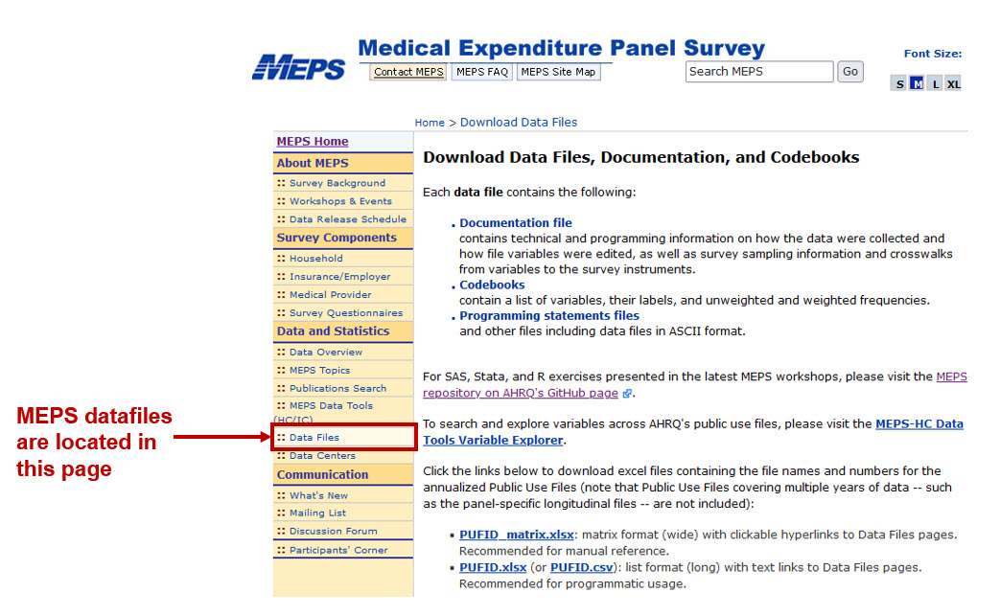
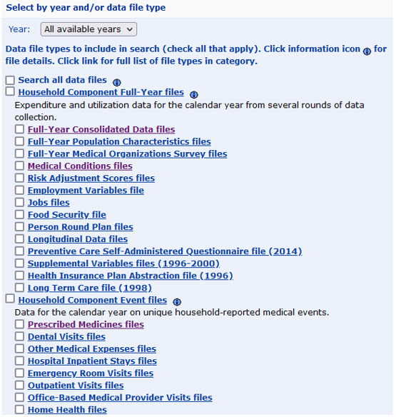
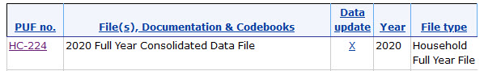

# Introduction
The Agency for Healthcare Research and Quality (AHRQ) [Medical Expenditure Panel Survey (MEPS)](https://www.meps.ahrq.gov/mepsweb/) is a set of data on U.S. households about their healthcare expenditures. It includes data on the individual / household demographics, socioeconomic status, insurance coverage, and healthcare expenditures. Healthcare expenditures include data on health-related spending, medical conditions, prescriptions, and utilization (e.g., number of office-based visits). MEPS draws upon a nationally representative subsample from the [National Health Interview Survey](https://www.cdc.gov/nchs/nhis/index.htm?CDC_AA_refVal=https%3A%2F%2Fwww.cdc.gov%2Fnchs%2Fnhis.htm), which is conducted by the [National Center for Health Statistics](https://www.cdc.gov/nchs/index.htm). Hence, MEPS provides researchers with the ability to generate estimates for the representative U.S. population. 

## MEPS Data
MEPS data are located on their website in their [data files page](https://www.meps.ahrq.gov/mepsweb/data_stats/download_data_files.jsp). You can find data from 1996 to the most recent available year (during the writing of this tutorial, 2020 was the latest release).

```{r, echo = FALSE, out.width = "100%", fig.cap = "Figure 1 - Location of MEPS data files"}

```

The MEPS data files include the [Full-Year Consolidated Data files](https://www.meps.ahrq.gov/mepsweb/data_stats/download_data_files_detail.jsp?cboPufNumber=HC-224), which is the calendar-year summary of the different longitudinal panels. The Full-Year Consolidated Data files contain information on the annual healthcare expenditures by the type of care; it contains data on spending, insurance coverage, health status, patient satisfaction, and several health conditions. The Full-Year Consolidated Data files also contains information from several surveys (e.g,. Diabetes Care Survey). 


```{r, echo = FALSE, out.width = "100%", fig.cap = "Figure 2 - Full-Year Consolidated Data files and other data types"}

```

## Load MEPS data into R
MEPS data can be downloaded onto your local storage and read into a statistical software program such as Stata or R. But you can also communicate directly with the AHRQ MEPS website to load your data rather than having to download it. We will load the Full-Year Consolidated Data file from 2020, which is named `HC-224`. To find out the name of the file, you will need to go MEPS data files site and click on the Full-Year Consolidated Data files. In this page (Figure 2), you can see the data file with the code `HC-224`, which is the Full-Year Consolidated Data file for 2020. When we enter this into our R code, we will use the file name `h224`.

```{r, echo = FALSE, out.width = "100%", fig.cap = "Figure 3 - H224 is the MEP 2020 Full-Year Consolidated Data file."}

```

You will need to download and install the [`MEPS` package](https://github.com/e-mitchell/meps_r_pkg). The `MEPS` package will provide tools for you to load and manipulate the MEPS Data files. You will need to have R `devtools` package installed. 

```{r, echo = TRUE}
## Install the devtools package
# install.packages("devtools") ## You only need to install this once
# library("devtools")  ## You will need to reload the MEPS package each time you restart R
# install_github("e-mitchell/meps_r_pkg/MEPS") ## This will install the MEPS package for R
```

There are two methods to load MEPS data into R.

Method 1 requires that you know the file name. In this example, the MEPS 2020 Full-Year Consolidated Data file is named `h224`. We will use the `read_MEPS` function to load the MEPS data onto R.

When using Method 2 to load the MEPS data, we don't need to know the file name, but we need to know the year and the data type. For example, for the Full-Year Consolidated Data file, we use the `year = 2020` and `type = "FYC"` option. For this method, we will also use the `read_MEPS` function to the MEPS data onto R.

The `tolower` function is used to change all the variable names from upper case to lower case. MEPS defaults the column names to upper case. I like to change this to lower case because it's easier for me to type. 

```{r, echo = TRUE}
### Load the MEPS package
library("MEPS") ## You need to load the library every time you restart R

#### Method 1: Load data from AHRQ MEPS website
hc2020 = read_MEPS(file = "h224")

#### Method 2: Load data from AHRQ MEPS website
hc2020 = read_MEPS(year = 2020, type = "FYC")

## Change column names to lowercase
names(hc2020) <- tolower(names(hc2020))
```

There are over 1400 variables in the MEPS 2020 Full-Year Consolidated Data file. We can reduce this to the essential variables using the `subset` function. This will generate a smaller data frame that we will call `keep_meps`. The variables that we want to collect are the subject unique identifier (`dupersid`), the survey weights (`varpsu`, `varstr`, `perwt20f`), and the total healthcare expenditures for 2020 (`totexp20`). 

```{r, echo = TRUE}
### Keep the subject's unique ID, survey weights, and total expenditures
keep_meps <- subset(hc2020, select = c(dupersid, varpsu, varstr, perwt20f, totexp20))

head(keep_meps) ## View the first six rows of the data frame
```

Since MEPS uses a complex survey design, these weights are needed to estimate standard errors that are reflective of the representative sample of the U.S. population. We'll learn how to apply these survey weights to the MEPS data files in a future tutorial.

## Conclusions
Loading MEPS data into R allows us to perform analysis easily and quickly. In this tutorial, you learned how to load MEPS data into R directly from the MEPS website. However, you can also download the MEPS data onto your local storage and use the `setwd` command to set the working directory. 

In future tutorials, we'll learn how to apply the survey weights and perform descriptive analyses using the MEPS data files. 

## Acknowledgements
There are a lot of tutorials on how to use MEPS data with R. I found the [AHRQ MEPS GitHub page](https://github.com/HHS-AHRQ/MEPS) to be an invaluable resource. 

This is a work in progress, and I may update this in the future. 
