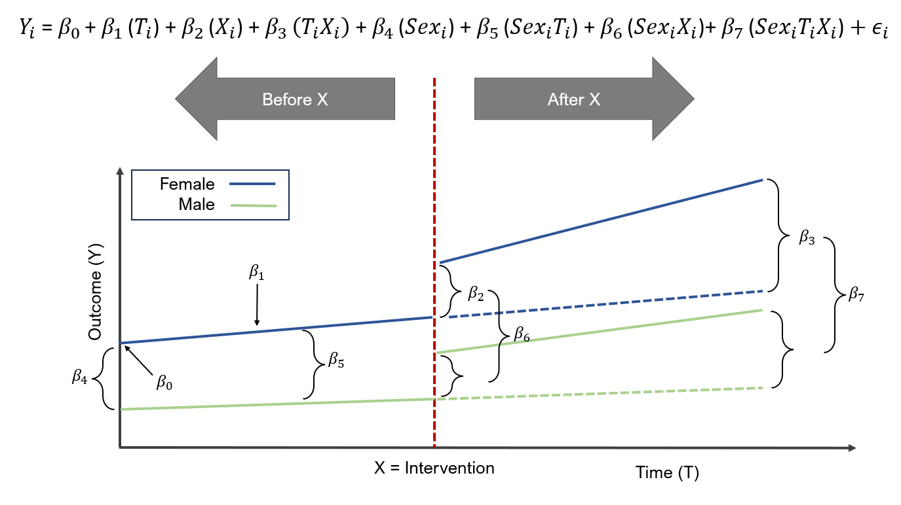
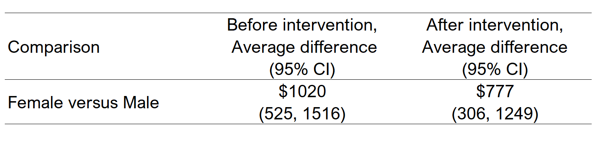
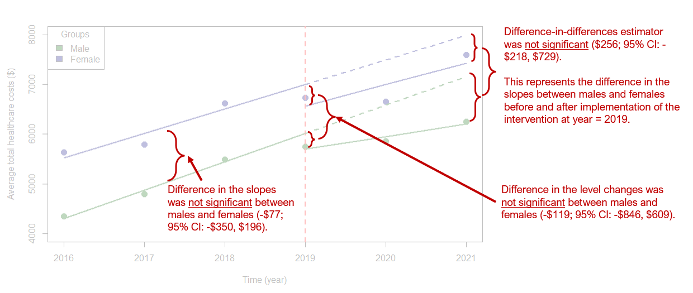
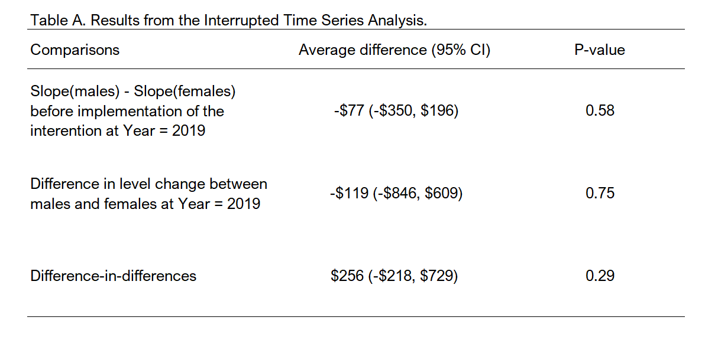

# Interrupted time series analysis (ITSA) with R: A short tutorial {#itsa}

## Introduction
Previously, I wrote a tutorial on how to perform an interrupted time series analysis (ITSA) in `Stata`, which is located on my RPubs site ([link](https://rpubs.com/mbounthavong/itsa_stata)). This had me thinking of how to perform an ITSA using `R`. So, I decided to create a short tutorial on how to perform an ITSA on `R` using the [Agency for Healthcare Research and Quality (AHRQ) Medical Expenditure Panel Survey (MEPS)](https://meps.ahrq.gov/mepsweb/) dataset. I tried several ways to do this, and I think I've found a nice approach that leverages survey weights from the MEPS database. Although I'm writing this ITSA tutorial with this approach, I plan on researching <u>other methods</u> to perform an ITSA in `R` so stay tuned. 

This short tutorial will summarize how to perform an ITSA using a linear regression model with survey weights applied from the MEPS database. (Note: I previously wrote a tutorial on how to apply weights from MEPS data ([link](https://rpubs.com/mbounthavong/MEPS_tutorial_3_applying_weights)). 

## Motivating example - Total Healthcare Costs from 2016 to 2021 by sex
We'll use the MEPS database to compare the trends in total healthcare costs between sex. We'll assume that a policy or intervention was implemented in 2019, which may have changed the healthcare costs levels and trends between males and females. 

I pooled data from 2016 to 2021 and adjusted the weights. I won't go into details on how to create this dataset for this tutorial since I provided a detailed summary in a previous tutorial. For more details on how I created this dataset, please refer to my previous tutorial ([link](https://rpubs.com/mbounthavong/MEPS_tutorial_5_simple_trend_analysis)).

```{r, echo = TRUE, warning = FALSE, message = FALSE}
# To install MEPS package in R, you need to do a couple of things.
### Step 1: Install the "devtools" package. 
#install.packages("devtools")

### Step 2: Install the "MEPS" package from the AHRQ MEPS GitHub site. 
#devtools::install_github("e-mitchell/meps_r_pkg/MEPS")

### step 3: Load the MEPS package
library("MEPS") ## You need to load the library every time you restart R

### Step 4: Load the other libraries
library("survey")
library("foreign")
library("dplyr")
library("ggplot2")
library("questionr") # remotes::install_github("juba/questionr")
library("lspline")  # devtools::install_github("mbojan/lspline", build_vignettes=TRUE)
library("ggeffects") # remotes::install_github("strengejacke/ggeffects")
library("margins")


# There are two ways to load data from AHRQ MEPS website:
#### Method 1: Load data from AHRQ MEPS website
hc2021 = read_MEPS(file = "h233")
hc2020 = read_MEPS(file = "h224")
hc2019 = read_MEPS(file = "h216")
hc2018 = read_MEPS(file = "h209")
hc2017 = read_MEPS(file = "h201")
hc2016 = read_MEPS(file = "h192")


#### Method 2: Load data from AHRQ MEPS website
hc2021 = read_MEPS(year = 2021, type = "FYC")
hc2020 = read_MEPS(year = 2020, type = "FYC")
hc2019 = read_MEPS(year = 2019, type = "FYC")
hc2018 = read_MEPS(year = 2018, type = "FYC")
hc2017 = read_MEPS(year = 2017, type = "FYC")
hc2016 = read_MEPS(year = 2016, type = "FYC")


## Change column names to lowercase
names(hc2021) <- tolower(names(hc2021))
names(hc2020) <- tolower(names(hc2020))
names(hc2019) <- tolower(names(hc2019))
names(hc2018) <- tolower(names(hc2018))
names(hc2017) <- tolower(names(hc2017))
names(hc2016) <- tolower(names(hc2016))


# We need the linkage file with the appropriate stratum of the primary sampling unit (STRA9621) and primary sampling unit (PSU9621). (Note: Each year, the linkage file sampling unit name changes)
linkage = read_MEPS(type = "Pooled linkage") 
names(linkage) <- tolower(names(linkage)) # change variable name to lower case


# Select specific variables

### 2021
hc2021p = hc2021 %>%
  rename(
    perwt = perwt21f,
    totexp = totexp21,
    ertexp = ertexp21) %>%
  select(
    dupersid, 
    panel, 
    varstr, 
    varpsu,
    perwt,
    sex,
    totexp,
    ertexp)
hc2021p$year <- 2021

### 2020
hc2020p = hc2020 %>%
  rename(
    perwt = perwt20f,
    totexp = totexp20,
    ertexp = ertexp20) %>%
  select(
    dupersid, 
    panel, 
    varstr, 
    varpsu,
    perwt,
    sex,
    totexp,
    ertexp)
hc2020p$year <- 2020


### 2019
hc2019p = hc2019 %>%
  rename(
    perwt = perwt19f,
    totexp = totexp19,
    ertexp = ertexp19) %>%
  select(
    dupersid, 
    panel, 
    varstr, 
    varpsu,
    perwt,
    sex,
    totexp,
    ertexp)
hc2019p$year <- 2019

### 2018
hc2018p = hc2018 %>%
  rename(
    perwt = perwt18f,
    totexp = totexp18,
    ertexp = ertexp18) %>%
  select(
    dupersid, 
    panel, 
    varstr, 
    varpsu,
    perwt,
    sex,
    totexp,
    ertexp)
hc2018p$year <- 2018

### 2017
hc2017p = hc2017 %>%
  rename(
    perwt = perwt17f,
    totexp = totexp17,
    ertexp = ertexp17) %>%
  select(
    dupersid, 
    panel, 
    varstr, 
    varpsu,
    perwt,
    sex,
    totexp,
    ertexp)
hc2017p$year <- 2017

### 2016
hc2016p = hc2016 %>%
  rename(
    perwt = perwt16f,
    totexp = totexp16,
    ertexp = ertexp16) %>%
  select(
    dupersid, 
    panel, 
    varstr, 
    varpsu,
    perwt,
    sex,
    totexp,
    ertexp)
hc2016p$year <- 2016


# Merge data and adjust the person weight by 6 years
pool_data = bind_rows(hc2021p, 
                      hc2020p,
                      hc2019p,
                      hc2018p,
                      hc2017p,
                      hc2016p) %>%
  mutate(poolwt = perwt / 6)


# Add a new variable for the pre-post index year at 2019
pool_data$period[pool_data$year >= 2016 & pool_data$year < 2019] = 0
pool_data$period[pool_data$year >= 2019 & pool_data$year < 2022] = 1
head(pool_data)


# Reduce the linkage file to only include dupersid, panel, stra9621, psu9621
linkage_file = linkage %>%
  select(dupersid, panel, stra9621, psu9621)

# Merge link file with main data
pool_data_linked = left_join(pool_data,
                             linkage_file, 
                             by = c("dupersid", "panel"))
```

## Interrupted Time Series Analysis Design
In this ITSA motivating example, we are going to compare the trends in healthcare total costs between males and females before and after the hypothetical policy intervention, which was implemented in 2019. The ITSA design is illustrated in the figure below. 

For this example, the ITSA model is denoted by the following:

$Y_i = \beta_0 + \beta_1(T_i) + \beta_2(X_i) + \beta_3(T_i * X_i) + \beta_4(Sex_i) + \beta_5(Sex_i * T_i) + \beta_6(Sex_i * X_i) + \beta_7(Sex_i * T_i * X_i) + \epsilon_i$,

where $Sex_i$ is a new variable that denotes the groups (e.g., sexes), $\beta_4$ denotes the difference in the outcomes between the groups (e.g., sexes) at beginning of the study ($T = 0$), $\beta_5$ denotes the difference in the slopes between the groups before the intervention, $\beta_6$ denotes the difference in the level changes between the groups immediately after implementation of the intervention $X$, and $\beta_7$ denotes the difference in the slopes after and before the intervention between the groups (e.g., difference-in-differences).  

```{r, echo = FALSE, warning = FALSE, message = FALSE, out.width = "100%", fig.cap = "ITSA for two groups (`sex`) before and after the intervention (`X`)."}

```

## Set up the survey options
In order to estimate the appropriate costs and standard errors, we will need to set up the survey options and survey design using the weights from MEPS. We will use the `svydesign` function to load the primary sampling unit, individual weights, and strata, which we will then assign to an object called `survey_design`. Please see the code below:

```{r, echo = TRUE, warning = FALSE, message = FALSE}
# Set the survey options
options(survey.lonely.psu = "adjust")
options(survey.adjust.domain.lonely = TRUE)


# Define the survey design
survey_design = svydesign(
                          id = ~psu9621,
                          strata = ~stra9621,
                          weights = ~poolwt,
                          data = pool_data_linked,
                          nest = TRUE)
```

## Descriptive analysis
Once that's done, we can do some descriptive analysis. 

Using the `svytable` function, we can estimate the weighted-sample of males and females in the United States (US). In our MEPS dataset, there are 160,228,773 males and 166,678,038  females, which is representative of the non-institutionalized civilian US population. 

```{r, echo = TRUE, warning = FALSE, message = FALSE}
svytable(~sex, design = survey_design)
```

Moreover, we can look at the survey-weighted total healthcare costs between males and females. For instance, in 2016, the average annual total healthcare costs for males and females were \$4351 and \$5633 per person, respectively. 

```{r, echo = TRUE, warning = FALSE, message = FALSE}
df1 <- svyby(~totexp, ~year+sex, survey_design, svymean)
df1
```

We can also look at the survey-weighted average cost before and after the intervention (before and after 2019). For instance, before the intervention the survey-weighted average total healthcare cost for males and females were \$4880 and \$6016, respectively. After the intervention, the survey-weighted average total healthcare costs for males and females were \$5954 and \$6997, respectively.

```{r, echo = TRUE, warning = FALSE, message = FALSE}
df2 <- svyby(~totexp, ~sex+period, survey_design, svymean)
df2
```

We can visualize the trend of the survey-weighted total healthcare costs for males and females from 2016 to 2021 using the `ggsurvey` function. From the plot, we can see that the female group had a higher total healthcare cost trend compared to males. 

```{r, echo = TRUE, warning = FALSE, message = FALSE}
# Plot total expenditures over time (Load the "questionr" package to use "ggsurvey")
ggsurvey(survey_design) +
  aes(x = year, y = totexp, group = factor(sex), color = factor(sex)) +
  stat_summary(fun.y = "mean", geom = "line", size = 2)
```

## Linear regression model
We can now construct our linear regression model using the ITSA framework. Because we have survey-weights that need to be applied, we will use the `svyglm` function. We will have several interaction terms according to the ITSA formula presented above. The triple interaction term (`factor(period):factor(sex):year`) denotes the difference-in-differences estimation. In other words, it is the difference in total healthcare costs between males and females before and after the intervention was implemented. Think of it as subtracting the difference before and after for males and the difference before and after for females. Thus, we are getting two types of differences or the difference-in-differences. 

* `sex` denotes our grouping variable

* `period` denotes the binary variable that denotes when the intervention was implemented (`0 = before`, `1 = after`)

* `year` denotes the time variable in the model

```{r, echo = TRUE, warning = FALSE, message = FALSE}
# ITSA: Triple interaction approach
itsa1 <- svyglm(totexp ~ factor(sex) + factor(period) + year + factor(period):factor(sex) + factor(sex):year + factor(period):factor(sex):year, design = survey_design) ## ITSA linear model
itsa1.confint <- confint(itsa1) ## generate the 95% CI

# "cbind" the coefficient output with 95% CI output
round(
  cbind(
    summary(itsa1, df.resid = degf(itsa1$survey.design))$coef, 
    confint(itsa1, df = degf(itsa1$survey.design))
  ), 2)
```

## Plot
We can plot our ITSA along with the counterfactuals. We create two new objects `itsa1` and `itsa2`, which contain the predicted values from our model. The first object `itsa1` contains the predictive value with all of our terms including the triple interaction. The second object `itsa2` contains only the counterfactual terms. 

```{r, echo = TRUE, warning = FALSE, message = FALSE}
#############
# Plot
#############
### Plot: Part 1 - Generate the predictions
plot.itsa1 <- ggpredict(itsa1, terms = c("year", "sex", "period"), ci.level = 0.95) # Full model
plot.itsa2 <- ggpredict(itsa1, terms = c("year", "sex"), ci.level = 0.95) # Counterfactual


### Plot: Part 2 - Plot the fitted values
# Start with the scatter (average values at each year by group)
colors <- c("darkgreen", "navyblue") # Create color vector

plot(df1$year, df1$totexp, pch = 19, cex = 1.5, lwd = 1,
     col = colors[factor(df1$sex)],
     xlab = "Time (year)", 
     ylab = "Average total healthcare costs ($)",
     ylim = c(4000, 8000))
legend("topleft", title = "Groups", 
       legend = c("Male", "Female"),
       fill = c("darkgreen", "navyblue"))

# Add the lines for the per-post index periods
with(subset(plot.itsa1, x <= 2019 & group == 1 & facet == 0), lines(x, predicted, col = "darkgreen", lwd = 2))
with(subset(plot.itsa1, x <= 2019 & group == 2 & facet == 0), lines(x, predicted, col = "navyblue", lwd = 2))
with(subset(plot.itsa1, x >= 2019 & group == 1 & facet == 1), lines(x, predicted, col = "darkgreen", lwd = 2))
with(subset(plot.itsa1, x >= 2019 & group == 2 & facet == 1), lines(x, predicted, col = "navyblue", lwd = 2))

# Line for the index period
abline(v = 2019, col = "red", lty = 2, lwd = 2)

# Counterfactual lines
with(subset(plot.itsa2, x >= 2019 & group == 1), lines(x, predicted, col = "darkgreen", lty = 2, lwd = 2))
with(subset(plot.itsa2, x >= 2019 & group == 2), lines(x, predicted, col = "navyblue", lty = 2, lwd = 2))
```


## Parallel trends assumption
The most critical part of the ITSA results are the parallel trends assumption and the difference-in-differences estimator. 

Let's start with the parallel trends assumption. We need to test to see if the trends between males and females are similar <u>before</u> the implementation of the intervention, which we can find in our model output. Based on our findings (see `factor(sex)2:year` coefficient), the slopes between the two groups (males and females) before the intervention were not statistically different (average difference = -\$77 (95% CI: -\$350, \$196). This means that the slopes are not significantly different between males and females. See ITSA Figure below with annotations.

Once we are confident that the trends prior to the implementation of the intervention are not different, any changes we see after the intervention can be attributed to the intervention. This is an important condition for the difference-in-differences design. 

## Additional estimations
We can use the `margins` command to estimate the partial derivatives of the total healthcare costs along different parts of the timeline. 

For instance, the average difference in total healthcare costs for males and females <u>before</u> and <u>after</u> the intervention were \$1020 and \$777, respectively. I've summarized these results into a table below.

```{r, echo = TRUE, warning = FALSE, message = FALSE}
### Average difference total costs in the pre- and post-intervention periods. 
margins1 <- margins(itsa1, type = "response", design = survey_design, at = (list(period = 0:1)), variables = "sex")
summary(margins1)
```

```{r, echo = FALSE, warning = FALSE, message = FALSE, out.width = "100%", fig.cap = "Differences in total healthcare costs between males and females."}

```

We could also estimate the slopes or the average annual change in the total healthcare costs for males and females <u>after</u> the intervention using the `margins` commands. For instance, average annual change in total healthcare costs for males and females are \$252 and \$431, respectively. 

```{r, echo = TRUE, warning = FALSE, message = FALSE}
### Slopes after the intervention
margins3 <- margins(itsa1, type = "response", design = survey_design, at = (list(period = 1, sex = (1:2))), variables = "year")
summary(margins3)
```

## Issues with the current model
However, it is not possible to compare the slopes using the `R` version of the `margins` package. I have tried to search for a way to do this, but the `margins` package for `R` currently can't perform this comparison. You can follow the discussion on the `margins` GitHub page ([link](https://github.com/leeper/margins/issues/124)), which discusses some potential solution. However, I prefer to use `Stata` for these comparisons. Fortunately, there is a way to make some important conclusions using a different method--the <u>linear spline model</u>.

## Workaround using a linear spline model
We could get the difference in the level change <u>immediately after</u> implementation of the intervention at `year == 2019` using the `lspline` command. We can also get the difference-in-differences estimate with this approach. 

```{r, echo = TRUE, warning = FALSE, message = FALSE}
# ITSA: Linear splines approach
### Create a knot at 2019
spline1 <- svyglm(totexp ~ factor(sex) + factor(period) + lspline(year, c(2019), marginal = TRUE) + factor(sex):lspline(year, c(2019), marginal = TRUE) + factor(sex):factor(period), design = survey_design)
spline1.confint <- confint(spline1)

# Output with 95% CI
round(
  cbind(
    summary(spline1, df.resid = degf(spline1$survey.design))$coef, 
    confint(spline1, df = degf(spline1$survey.design))
  ), 2)
```

The linear spline model creates `knots` that automatically replaces some of the interactions in our previous model. For example the model element `factor(sex):lspline(year, c(2019)` replaces the triple interaction `factor(period):factor(sex):year` from our previous model. 

You'll notice that some of the coefficient values are similar to our first model. For instance, in our first model, the `year` coefficient was equal to \$568, and in the linear splines model, the `lspline(year, c(2019), marginal = TRUE)1` coefficient was equal to \$568. This denotes the average change in annual total healthcare costs for males before the implementation of the intervention at `year == 2019`. 

However, you'll also notice some differences. In the linear splines model, we have a couple of important coefficients that will help to complete our evaluation of the ITSA model. 

## Differences in level immediately after implementation of the intervention
One of the most important changes we are interested in is the *immediate* change after implementation of the intervention at `year == 2019`. This is captured with the `factor(sex)2:factor(period)1` coefficient, which has a value equal to -\$119 (95% CI: -\$846, \$609). This tells me that the difference in level change at `year == 2019` was lower for females than males; however, this difference was not statistically significant. See ITSA Figure below with annotations.

## Difference-in-differences estimation
Lastly, we can identify the difference-in-differences estimate from the linear spline model output in the form of the `factor(sex)2:lspline(year, c(2019), marginal = TRUE)2` coefficient, which has a value equal to \$256 (95% CI: -\$218, \$729). This coefficient denotes that average annual change in total healthcare expenditure between males and females before and after implementation of the intervention. In other words, this is a difference in the slopes for males before and after the intervention minus the difference in the slopes for females before and after the intervention. Hence, the term `difference-in-differences`. See ITSA Figure below with annotations.

```{r, echo = FALSE, warning = FALSE, message = FALSE, out.width = "100%", fig.cap = "ITSA figure with annotations."}

```


## Putting it all together
With the ITSA, we will summarize our findings into a table. These include the main coefficients from the ITSA model. 

```{r, echo = FALSE, warning = FALSE, message = FALSE, out.width = "100%", fig.cap = "Summary table for main ITSA coefficients."}

```


## Conclusions
The ITSA model is a very useful design to generate causal interpretation as long as the assumptions hold. For instance, the parallel trends assumptions needs to be assessed. Without it, it will be difficult to argue that the intervention was the only factor that could have impacted the changes in the level and trends between the groups. 

In this tutorial, I ran into an issue with the first ITSA model using interaction terms. It didn't provide me with the necessary coefficients to determine the main coefficients for the ITSA. For instance, I had to use a linear spline model to identify the difference-in-differences estimate. Although the ITSA model with the triple interaction was useful in generating the plot, I could have started with the linear splines model and generated the ITSA plot afterwards with the triple interaction model. 

At the end of the day, I was able to generate a summary table and a very nice figure of the ITSA. However, I will continue to learn more about other contrasting packages such as [`emmeans`](https://github.com/rvlenth/emmeans) and [`marginaleffects`](https://github.com/vincentarelbundock/marginaleffects). 

Although the `margins` package in `R` doesn't have the `pwcompare` feature from `Stata`, there are some potential workarounds that I'll investigate further. Discussion about this can be found in the `margins` GitHub issues forum ([link](https://github.com/leeper/margins/issues/124))


## Acknowledgements
As always, I am grateful to the `R` community for producing wonderful tools for novices like me. I've learned so much reading documents, forums, and issues online that it would be impossible to credit everyone. But I would like to highlight a few superstars that I think deserve special recognition. 

I am grateful to the author of the `margins` package, Thomas J. Leeper. You can find his `margins` package on his [`GitHub site`](https://github.com/leeper/margins).

Additionally, the `marginaleffects` package by Vincent Arel-Bundock has helped me to compare some of `R`'s marginal effects commands with `Stata`. You can find his GitHub site [here](https://github.com/vincentarelbundock/marginaleffects). 

The `emmeans` package was developed by Russel V. Length, which I plan on learning more about on his GitHub site ([link](https://github.com/rvlenth/emmeans)). Note: I found a nice overview of the `emmeans` package by Ariel Muldoon that I encourage interested users to read ([link](https://aosmith.rbind.io/2019/03/25/getting-started-with-emmeans/)). 

The `ggeffect` package was very useful in helping me develop some very nice plots, which you can learn more about on their GitHub site ([link](https://strengejacke.github.io/ggeffects/)). 

Lastly, I found this amazing site on ITSA by Chrissy H. Roberts [here](https://rpubs.com/chrissyhroberts/1006858). Her site helped me to create the ITSA plot which is in this tutorial. I hope you get a chance to read her blog on how to conduct an ITSA in R. I think she does a much better job that I did with this tutorial. 


## Work in progress
This is a work in progress so expect some updates in the future.


## Disclaimers
Any errors or mistakes are those of the author.

This is only for educational purposes.

This was built under R version 4.3.1 "Beagle Scouts"

