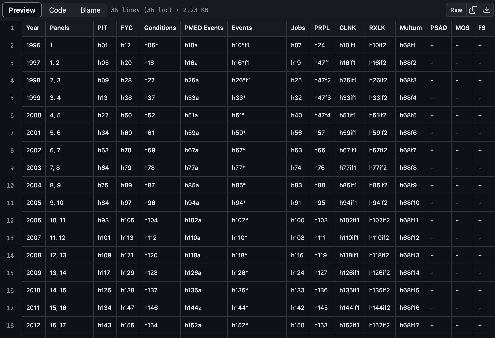
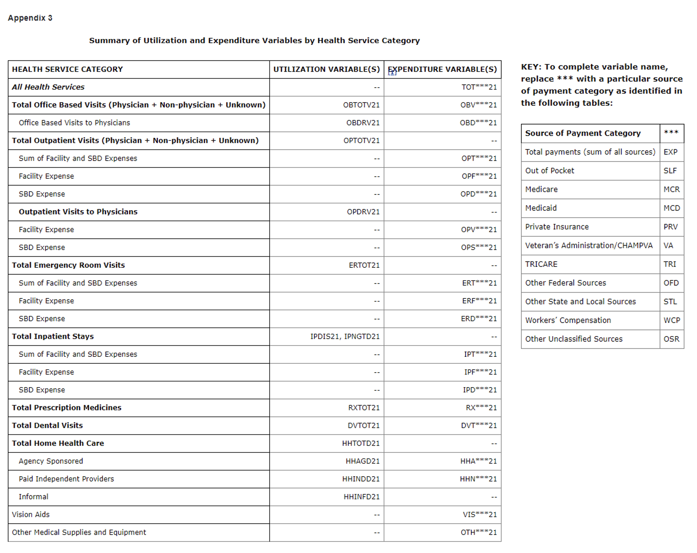
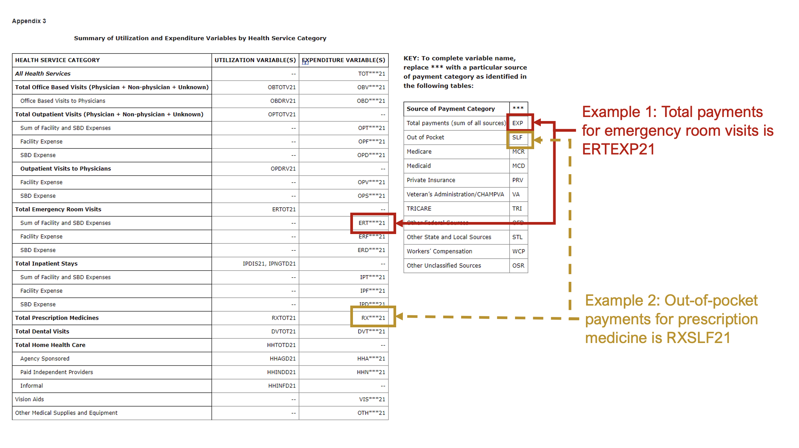

# Helpful Notes {#notes}

## Introduction

There are several things that I've learned while exploring and using the Agency for Health Research and Quality (AHRQ) Medical Expenditure Panel Survey (MEPS) data. Although there are (very good) documentations provided by AHRQ MEPS, I thought I would write a short article about some of the ("hard") lessons I learned. 

In this article, I summarize some of these lessons in no particular order. I may expand on this list as time goes on, but for now, I will start off with a few of these.


### 1. MEPS file names

AHRQ MEPS has a [GitHub site](https://github.com/HHS-AHRQ/MEPS/tree/master) with a lot of resources. One of the most useful resource is a list of their MEPS files. This list contains the MEPS file names, which are used to identify the data for import using the `MEPS` package. 

For example, we can use the `read_MEPS()` function to import the MEPS file of interest (Note: Make sure you have an internet connection). The file name for the 2021 Full-Year Consolidated File is `"h233"`. 

```{r, echo = TRUE, message = FALSE, warning = FALSE}
### Load MEPS library
library("MEPS")

### Import the 2021 Full Year Consolidated File
hc2021 = read_MEPS(file = "h233") # Full-year consolidated file
```

You can find the list of the MEPS file names [here](https://github.com/HHS-AHRQ/MEPS/blob/master/Quick_Reference_Guides/meps_file_names.csv). 

Here is an example of some of the file codes:

```{r, echo = FALSE, warning = FALSE, message = FALSE, out.width = "100%", fig.cap = "Figure - MEPS file codes example."}

```


### 2. Expenditure categories

MEPS contains a ton of expenditure categories such as outpatient and inpatient. This is helpful when you want to **deconstruct** the total expenditures into its different components. 

Here is a list of the various expenditure categories from the [2021 Full Year Consolidated file](https://meps.ahrq.gov/data_stats/download_data/pufs/h233/h233doc.shtml). 

```{r, echo = FALSE, warning = FALSE, message = FALSE, out.width = "100%", fig.cap = "Figure - MEPS expenditure categories."}

```


#### 2.1. Example expenditure categories

For example, the 2021 annual costs variable for office-based visits is `OBVEXP21`. Each of these expenditure categories represent different areas of care that an individual can access. I provide a summary of a select few. 

* `OBVEXP21` denotes the office-based visits costs for 2021. These include encounters that are provided in the physician's office or clinic setting. It does not include encounters associated with the hospital, nursing home, or patient's home.     

* `OBTOTV21` denotes the number of office-based visits in 2021. 

* `OPTEXP21` denotes the outpatient visit costs for 2021. These include encounters in hospital's outpatient departments. The total costs for an outpatient visit contains the facility and "SBD" expenses. (Note: "SBD" is short for "separate billing doctor" and refers to physicians who are billed separately for services provided at the hospital or site. They are not included in the facility-only costs.)

* `ERTEXP21` denotes the emergency department visit costs for 2021. Emergency department visit that result in an inpatient stay are "rolled" up into the inpatient costs. You should be aware that "double-counting" can occur as a consequence of this "roll-up." MEPS handles this by assigning \$0 to the emergency department facility costs. Physician costs and the number of emergency department visits are not affect by this "roll-up" issue. 

* `ERTOT21` denotes the number of emergency room visits in 2021. 

* `IPTEXP21` denotes the inpatient visit costs for 2021. Inpatient visit costs include the facility and SBD costs. 

* `IPDIS21` denotes the number of hospital discharges.

* `IPNGTD21` denotes the number of nights associated with hospital discharges. 

* `RXEXP21` denotes the total medication costs for 2021. These costs include payments by insurers, health plan benefits, public (Medicare and Medicaid), VA, and out-of-pocket costs. 

* `RXTOT21` denotes the number of prescription fills and refills for 2021. 

### 3. Sources of payments

Each expenditure is composed of various sources of payments. Some a mostly composed of public or private payers. Some are mostly out-of-pocket payments. MEPS breaks these down into many parts, the sum of which should equal the total expenditures. 

#### 3.1. Example of sources of payments
In Appendix 3, the `***` that are listed in the expenditure categories as placeholders for the source of payment codes. These codes are listed in the Figure above. For example, the code for total payments is `EXP`, and the code for out-of-pocket payments is `SLF` or self. Thus, the total payments for emergency department visits in 2021 is `ERTEXP21`, and the out-of-pocket payments for total prescription medicines in 2021 is `RXSLF21`.

Below is an illustration on how to match expenditure variable codes with the source of payment codes. 

```{r, echo = FALSE, warning = FALSE, message = FALSE, out.width = "100%", fig.cap = "Figure - MEPS expenditure categories."}

```


## References

Most of the information can be found on the AHRQ MEPS [website](https://meps.ahrq.gov/mepsweb/). I encourage the learner to read through the documentations for each data file. It's rich with useful information. 

Another great resource is the AHRQ MEPS GitHub [page](https://github.com/HHS-AHRQ/MEPS). There are example codes on how to use the MEPS data based on R, Stata, and SAS. 


## Disclaimer

I plan to update this as I learn more about MEPS data, so stay tuned. 

This is for educational purposes only. 


