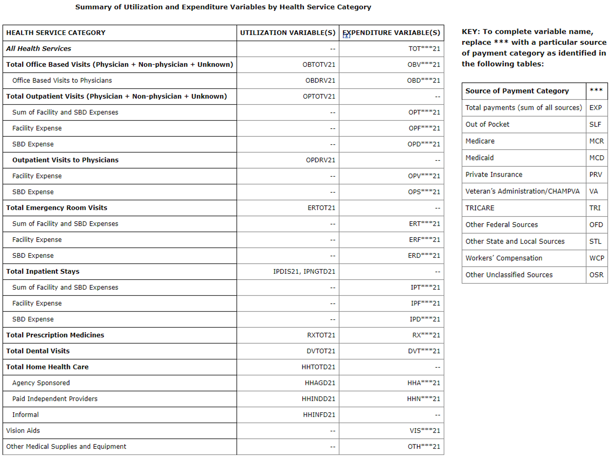
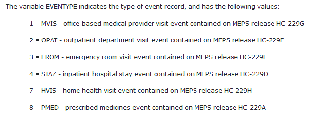
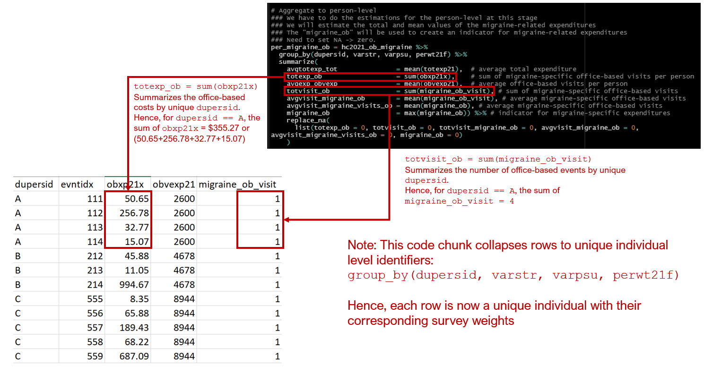
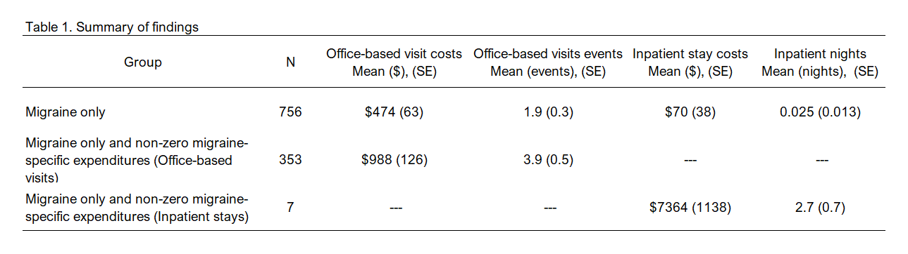

# Using condition-event link (`CLNK`) file {#clnk}

## Introduction
The Agency for Healthcare Research and Quality (AHRQ) Medical Expenditure Panel Survey (MEPS) categorizes expenditures into different components. Healthcare expenditures (e.g., costs and utilization) are provided for each individual respondent in MEPS. For instance, healthcare expenditures are categorized as total healthcare expenditures (`totexp21`), office-based expenditures (`obvexp21`), outpatient expenditures (`opvexp21`), inpatient expenditures (`iptexp21`), and prescription expenditures (`rxexp21`) to name a few. Reading the long but detailed [documentation](https://meps.ahrq.gov/data_stats/download_data/pufs/h233/h233doc.shtml) is a good way to learn more about the different expenditure categories. Moreover, you can also review **Appendix 3** of the documentation (see Figure below). 

```{r, echo = FALSE, warning = FALSE, message = FALSE, out.width = "100%", fig.cap = "MEPS Appendix 3 - Expenditure variables"}

```

These costs and utilization provide information about the annual expenditures associated with each category for each individual respondent. But this doesn't provide <u>disease-specific expenditures</u>. For example, an individual may have an annual office-based visits healthcare cost of \$10,000, but part of this costs may be due to a specific disease such as migraine. How much of the \$10,000 is due to migraine-related office-based visits? One can answer this question using the [condition-event link (`CLNK`) file](https://meps.ahrq.gov/data_stats/download_data/pufs/h229i/h229idoc.shtml). 

The `CLNK` file has a unique variable that can be used to link each record on the [Medical Conditions file](https://meps.ahrq.gov/data_stats/download_data_files_detail.jsp?cboPufNumber=HC-231) with event files from the respective year (e.g., `HC-229D` through `HC-229H`). One of these event files that we're interested in is the office-based event file (`HC-229G`). The `CLNK` file contains 6 variables: 

* `dupersid` - 10-digit unique identifier

* `condidx` - 13-digit unique identifier for a condition

* `evntidx` - 16-digit unique identifier for each event

* `clnkidx` - 29-digit unique identifier for each record; combines `condidx` and `evntidx`

* `eventype` - indicates the type of event record (see Figure)

* `panel` - indicate the panel when the interview occurred


```{r, echo = FALSE, warning = FALSE, message = FALSE, out.width = "100%", fig.cap = "Type of event record (`eventype`)"}

```

Using these files, we can acquire disease-specific expenditures from MEPS data, which may be important for those of us who are interested in these expenditures. 

## Motivating example - Migraine-specific expenditures
In this motivating example, we will review how to use MEPS to find the office-based expenditures and inpatient expenditures specific to migraine.

### Part 1 - Setup
We will need to install several packages. The [AHRQ MEPS GitHub site](https://github.com/HHS-AHRQ/MEPS) is a great source for documents, tutorials, codes, and updates. I learned a ton going through their exercises, and a lot of the code you'll see in this tutorial come from those resources. 

```{r, echo = TRUE, warning = FALSE, message = FALSE}
# To install "MEPS" package in R, you need to do a couple of things.
### Step 1: Install the "devtools" package. 
#install.packages("devtools")


### Step 2: Install the "MEPS" package from the AHRQ MEPS GitHub site. 
#devtools::install_github("e-mitchell/meps_r_pkg/MEPS")


### Step 3: Load the MEPS package
library("MEPS") ## You need to load the library every time you restart R

### Step 4: Load the other libraries
library("survey")
library("foreign")
library("tidyverse")
library("psych")
```

Next, we set the global options.

```{r, echo = TRUE, warning = FALSE, message = FALSE}
# Set global options
options(survey.lonely.psu = "adjust") # survey option for lonely PSUs
options(dplyr.width = Inf) # Columns are not truncated
options(digits = 10) # Do not use scientific notation for large number
```

Once that's done, we will download the data directly from the MEPS site using the `read_MEPS` function. There are two ways to do this:

```{r, echo = TRUE, warning = FALSE, message = FALSE}

# There are two ways to load data from AHRQ MEPS website:
#### Method 1: Load data from AHRQ MEPS website
hc2021 = read_MEPS(file = "h233") # Full-year consolidated file
ob2021 = read_MEPS(file = "h229g") # Office-based visits
inpat2021 = read_MEPS(file = "h229d") # Inpatient stays
cond2021 = read_MEPS(file = "h231") # Medical conditions file
clnk2021 = read_MEPS(file = "h229IF1") # Condition-Event Link File (CLNK)


#### Method 2: Load data from AHRQ MEPS website
hc2021 = read_MEPS(year = 2021, type = "FYC") # Full-year consolidated file
ob2021 = read_MEPS(year = 2021, type = "OB") # Office-based visits
inpat2021 = read_MEPS(year = 2021, type = "IP") # Inpatient stays
cond2021 = read_MEPS(year = 2021, type = "COND") # Medical conditions file
clnk2021 = read_MEPS(year = 2021, type = "CLNK") # Condition-Event Link File (CLNK)
```

After the data are loaded, you can change the column names from upper case to lower case.

```{r, echo = TRUE, warning = FALSE, message = FALSE}
## Change column names to lowercase
names(hc2021) <- tolower(names(hc2021))
names(ob2021) <- tolower(names(ob2021))
names(inpat2021) <- tolower(names(inpat2021))
names(cond2021) <- tolower(names(cond2021))
names(clnk2021) <- tolower(names(clnk2021))
```

Each of these tables will have a lot of variables. To make things easier and cleaner, let's reduce the size of the tables to only include the essential variables. 

```{r, echo = TRUE, warning = FALSE, message = FALSE}
# Keep only the variables of interest
hc2021x = hc2021 %>%
  select(dupersid, totexp21, obvexp21, iptexp21, perwt21f, varpsu, varstr, sex, racev1x)

ob2021x = ob2021 %>%
  select(dupersid, evntidx, eventrn, obdateyr, obdatemm, obxp21x, perwt21f, varpsu, varstr)

inpat2021x = inpat2021 %>%
  select(dupersid, evntidx, eventrn, numnighx, ipxp21x, perwt21f, varpsu, varstr)

cond2021x = cond2021 %>%
  select(dupersid, condidx, icd10cdx, ccsr1x:ccsr3x)
```

Next, we want identify migraine condition from the `cond2021x` file, which is the medical conditions file. The CCSR code for migraine is `NVS010` (note: the ICD10 code for migraine is `G42`, but we won't need it for this example). There are three CCSR columns (`ccsr1x`, `ccsr2x`, `ccsr3x`), and we want to concatenate these into a new column called `all_CCSR` to isolate for migraine. You can find the list of CCSR codes in the [AHRQ MEPS site](https://github.com/HHS-AHRQ/MEPS/blob/master/Quick_Reference_Guides/meps_ccsr_conditions.csv). 

```{r, echo = TRUE, warning = FALSE, message = FALSE}
################################# NOTES ################################# 
## Use CLNK file to map condition with events
## CCSR code: https://github.com/HHS-AHRQ/MEPS/blob/master/Quick_Reference_Guides/meps_ccsr_conditions.csv
## CCSR code for migraine: NVS010
## ICD10 code for migraine: G43
######################################################################### 

# Restrict conditions to Migraine only from the conditions file
### This creates a variable called "all_CCSR" which concatenates the CCSR columns
### Then, filter() only selects rows with the "NVS010" text in the "all_CCSR" column
### Finally, this gets saved into the "migraine" object.
migraine = cond2021x %>% 
  unite("all_CCSR", ccsr1x:ccsr3x, remove = FALSE) %>% 
  filter(grepl("NVS010", all_CCSR))


# View freq per diagnosis code type (Pretty nice code from AHRQ)
migraine %>% 
  count(icd10cdx, ccsr1x, ccsr2x, ccsr3x) 
```

### Part 2 - Migraine-specific office-based expenditures
Now that we have our data files set up and prepared, we can begin to identify the migraine-specific office-based expenditures. 

First, we want to isolate the office-based visits events from the `clnk2021` file. According to the figure above, `eventype == 1` is for office-based medical provider visit event. We will save these results into a new object called `ob_events`.

```{r, echo = TRUE, message = FALSE, warning = FALSE}
############################################
## OUTPATIENT VISITS
############################################
# Select Office-based events from the CLNK file
ob_events = clnk2021 %>%
  filter(eventype == 1)
```

Next, we want to merge the `ob_events` object with the `migraine` object, which contains the migraine-related conditions. We use an `inner_join`, which will only subset rows that matches between the two objects by `dupersid` and `condidx`. This will be saved as a new object called `migraine_lnk`. 

```{r, echo = TRUE, warning = FALSE, message = FALSE}
# Merge migraine diagnosis conditions file with office-based visit file
migraine_lnk = inner_join(
  migraine, ob_events,
  by = c("dupersid", "condidx")
)
```

Since the `migraine_lnk` object has duplicate `dupersid` and `condidx`, we want to create an updated dataframe (`migraine_ob_distinct`) that contains unique rows of `dupersid`, `evntidx`, and `eventype`. AHRQ called this process "De-duplicate." We will use this term in our exercise.  

```{r, echo = TRUE, warning = FALSE, message = FALSE}
# Select only DISTINCT office-based events ("De-duplicate")
migraine_ob_distinct = migraine_lnk %>%
  distinct(dupersid, evntidx, eventype)
```

Then we merge the `migraine_ob_distinct` dataframe with the `ob2021x` dataframe using the `inner_join` function because we want to only include the rows that are in both dataframes. We use the `mutate` function to generate a new indicator variable called `migrane_ob_visit =1`. This will yield a dataframe that contains the office-based events specific for migraines. 

```{r, echo = TRUE, warning = FALSE, message = FALSE}
# Merge office-based file with distinct office-based CLNK event file
### Use the inner_join() to merge ob2021x and migraine_lnk_distinct dataframes
### Then create a new indicator variable called "migraine_ob_visit = 1."
ob_migraine = inner_join(
  ob2021x, migraine_ob_distinct) %>%
  mutate(migraine_ob_visit = 1)
```

Once that's done, we can merge the `ob_migraine` dataframe with the Full-Year Consolidated (`hc2021x`) dataframe. We create two indiciator variables: `migraine_ob = 1` to capture the total number of migraine-specific office-based visits, and `fyc = 1` to indicate that this is the Full-Year Consolidated file that was merged. 

```{r, echo = TRUE, warning = FALSE, message = FALSE}
# Merge with full-year consolidated file
### Use the full_join() to keep all the rows from both dataframes.
### Then create a new object called hc2021_ob_migraine
### & a new indicator variable called "migraine_ob = 1"
### & another new indicator variable called "fyc = 1."
### Note: These are not unique rows (repeated dupersid)
hc2021_ob_migraine = full_join(
  ob_migraine %>% mutate(migraine_ob = 1),
  hc2021x %>% mutate(fyc = 1))
```

Since this dataframe (`hc2021_ob_migraine`) contains duplicate `dupersid`, we want to create a dataframe where each row reflects a unique `dupersid`. We can do this by using the `group_by` function on specific variables that we know are unique to an individual (`dupersid`, `varstr`, `varpsu`, and `perwt21f`). These are the unique identifier of the individual and their associated stratum and weight. 

We also will summarize the migraine-specific utilization such as office-based visit costs (`obxp21x`) and the total sum of those visits (`migraine_ob_visit`).

```{r, echo = TRUE, warning = FALSE, message = FALSE}
# Aggregate to person-level
### We have to do the estimations for the person-level at this stage
### We will estimate the total and mean values of the migraine-related expenditures
### The "migraine_ob" will be used to create an indicator for migraine-related expenditures
### Need to set NA -> zero.
per_migraine_ob = hc2021_ob_migraine %>%
  group_by(dupersid, varstr, varpsu, perwt21f) %>%
  summarize(
    avgtotexp_tot               = mean(totexp21),  # average total expenditure
    totexp_ob                   = sum(obxp21x),    # sum of migraine-specific office-based visits per person
    avgexp_obvexp               = mean(obvexp21),  # average office-based visits per person
    totvisit_ob                 = sum(migraine_ob_visit), # sum of migraine-specific office-based visits
    avgvisit_migraine_ob        = mean(migraine_ob_visit), # average migraine-specific office-based visits
    avgvisit_migraine_visits_ob = mean(migraine_ob), # average migraine-specific office-based visits
    migraine_ob                 = max(migraine_ob)) %>% # indicator for migraine-specific expenditures
    replace_na(
      list(totexp_ob = 0, totvisit_ob = 0, totvisit_migraine_ob = 0, avgvisit_migraine_ob = 0, avgvisit_migraine_visits_ob = 0, migraine_ob = 0)
    )
```

The above code chunk seems intimidating, but there are sensible reasons why it is written this way. See the Figure below for a visual explanation. 

The <u>migraine-specific</u> office-based costs and visits are expenditures that are at the event level denoted by the event identifier `evntidx`. Costs like the total expenditures and office-based costs are at the individual level denoted by the individual identifier `dupersid`. Hence, you will see that at the event level, the <u>migraine-specific</u> office-based costs `obxp21x` differs by events (`evntidx`. Conversely, the office-based costs are the same by individual (`dupersid`).

We need to sum or add up the <u>migraine-specific</u> office-based costs for each individual so that we can collapse the rows. We want to do create a new dataframe where each row is a unique individual denoted by their individual identifier (`dupersid`) and corresponding survey weights (`varstr`, `varpsu`, `perwt21f`).

```{r, echo = FALSE, warning = FALSE, message = FALSE, out.width = "100%", fig.cap = "Visual explanation of the code chunk"}

```

Once this step is completed, you can check to see that the number of rows from the new dataframe (`per_migraine_ob`) is equal to the number of rows from the Full-Year Consolidated file (`hc2021`). They should be equal. 

```{r, echo = TRUE, warning = FALSE, message = FALSE}

### QC: Should have the same number as the full-year consolidated file
nrow(per_migraine_ob) == nrow(hc2021)
```

Now that you've merged the migraine-specific office-based expenditures with the Full-Year Consolidated file, we can start on repeating this process for the <u>migraine-specific inpatient expenditures</u>. 


### Part 3 - Migraine-specific inpatient expenditures
The code for the migraine-specific inpatient expenditures is similar to the migraine-specific office-based expenditures so I won't go through them step-by-step. However, there are several important differences. 

First, the inpatient event type is `eventype == 4`, which needs to be included when you isolate the event types from the `clnk2021` file. 

```{r, echo = TRUE, warning = FALSE, message = FALSE}

############################################
## INPATIENT STAYS
############################################
# Inpatient stays events
inpat_events = clnk2021 %>%
  filter(eventype == 4)

# QC: Should only have EVENTYPE == 4
inpat_events %>%
  count(eventype)


# Merge migraine diagnosis file with inpatient stays file
migraine_lnk_inpat = inner_join(
  migraine, inpat_events,
  by = c("dupersid", "condidx")
)

# Select only DISTINCT events ("De-duplicate")
migraine_inpat_distinct = migraine_lnk_inpat %>%
  distinct(dupersid, evntidx, eventype)


# Merge inpatient stays file with distinct migraine-specific inpatient stays file
### Use the inner_join() to merge ob2021x and migraine_inpat_distinct dataframes
### Then create a new indicator variable called "migraine_inpat_stays = 1."
inpat_migraine = inner_join(
  inpat2021x, migraine_inpat_distinct) %>%
  mutate(migraine_inpat_stays = 1)


# Merge with full-year consolidated file
### Use the full_join() to keep all the rows from both dataframes.
### Then create a new object called hc2021_inpat_migraine
### & a new indicator variable called "migraine_inpat = 1"
### & another new indicator variable called "fyc = 1."
### Note: These are not unique rows (repeated dupersid)
hc2021_inpat_migraine = full_join(
  inpat_migraine %>% mutate(migraine_inpat = 1),
  hc2021x %>% mutate(fyc = 1)
)


# Aggregate to person-level
### We have to do the estimations for the person-level at this stage
### We will estimate the total and mean values of the migraine-related expenditures
### The "migraine_inpat" will be used to create an indicator for migraine-related expenditures
### Need to set NA -> zero.
per_migraine_inpat = hc2021_inpat_migraine %>%
  group_by(dupersid, varstr, varpsu, perwt21f) %>%
  summarize(
    totnights_inpat                = sum(numnighx),
    totexp_inpat                   = sum(ipxp21x),
    avgexp_iptexp                  = mean(iptexp21),
    totvisit_inpat                 = sum(migraine_inpat_stays),
    avgvisit_inpat                 = mean(migraine_inpat_stays),
    avgvisit_migraine_visits_inpat = mean(migraine_inpat),
    migraine_inpat                 = max(migraine_inpat)) %>%
  replace_na(
    list(totnights_inpat = 0, totexp_inpat = 0, totvisit_inpat = 0, avgvisit_inpat = 0, avgvisit_migraine_visits_inpat = 0, migraine_inpat = 0)
  )

### QC: Should have the same number as the full-year consolidated file
nrow(per_migraine_inpat) == nrow(hc2021)
```


### Part 4 - Combine office-based and inpatient expenditure files
Once you have the <u>migraine-specific</u> inpatient expenditures dataframe completed, you can start the process to combine this with the <u>migraine-specific</u> office-based expenditures dataframe. 

First, we want to merge using the `left_join` function the migraine-specific office-based expenditure dataframe with the Full-Year Consolidated file `hc2021x`. We do this because there were a couple of variables in `hc2021x` that we would like to keep such as the sex (`sex`) and race (`racev1x`) variables. We will call this new dataframe `combined_data_ob_part`.


```{r, echo = TRUE, warning = FALSE, message = FALSE}
# COMBINE OBVISIT AND INPAT - SPECIFIC EXPENDITURE FILES
### Part 1: Combine the office-based visit exp file with the hc2021x file
combined_data_ob_part <- left_join(
  hc2021x, 
  per_migraine_ob,
  by = c("dupersid", "varstr", "varpsu", "perwt21f")
)
```

Then, we want to merge the migraine-specific inpatient expenditures `per_migraine_inpat` to the dataframe `combined_data_ob_part` to create a new dataframe called `combined_data_ob_inpat_part`.

```{r, echo = TRUE, warning = FALSE, message = FALSE}
### Part 2: Combine the inpatient stays file with the "combined_data_ob_part" file
combined_data_ob_inpat_part <- left_join(
  combined_data_ob_part, 
  per_migraine_inpat,
  by = c("dupersid", "varstr", "varpsu", "perwt21f")
)
```

Once that part is completed, we will have a dataframe that includes both the <u>migraine-specific</u> office-based visit and inpatient stay expenditures. 

Next, we will take this opportunity to create an indicator variable for individuals with a migraine diagnosis or condition. So far, we have identified and isolated office-based and inpatient expenditures that were <u>migraine-specific</u>. This means that some individuals with a migraine diagnosis may not have accrued any <u>migraine-specific</u> office-based or inpatient expenditures. It's possible that they have other expenditures, but those may not be <u>migraine-specific</u>. Hence, it is important that we create an indicator variable for those individuals with migraine in the comprehensive dataframe. 

```{r, echo = TRUE, warning = FALSE, message = FALSE}
### Part 3: Merge an indicator variable for migraine diagnosis. 
### Not all patients with migraine has an expenditure.

### a) Create a dataframe with the dupersid and migraine indicator.
migraine_distinct_qc = migraine %>% 
  distinct(dupersid) %>%
  mutate(migraine_indicator = 1)

### b) Merge "migraine_distinct_qc" to the larger table.
### This will be a 1 to 1 join.
combined_data_migraine <- left_join(
  combined_data_ob_inpat_part,
  migraine_distinct_qc,
  by = c("dupersid"))

### c) We also need to convert NA to 0 for the "migraine_indicator" variable.
combined_data_migraine = combined_data_migraine %>%
  replace_na(list(migraine_indicator = 0))
```


### Part 5 - Descriptive analysis using survey weights
There are many ways to describe the expenditures in the migraine population. 

First, we need to invoke the survey design for our data using the `svydesign` function. We will call this the `survey_cohort` design. 

```{r, echo = TRUE, warning = FALSE, message = FALSE}
# Define person-level survey design
survey_cohort = svydesign(
  id = ~varpsu, 
  strata = ~varstr,
  weights = ~perwt21f,
  data = combined_data_migraine,
  nest = TRUE)
```

Next, we can provide the average costs and amounts of office-based visit and inpatient stay expenditures for the whole cohort, both individuals with and without a migraine condition. We will use the `svyby` function to group the findings into those with migraine `migraine_indicator == 1` and those without migraine `migraine_indicator == 0`. 

Note: We expect to see zero costs and amount for the non-migraine individuals. 

```{r, echo = TRUE, warning = FALSE, message = FALSE}
### Average migraine-specific office-based visit costs and amount
svyby(~totexp_ob, ~migraine_indicator, survey_cohort, svymean)
svyby(~totvisit_ob, ~migraine_indicator, survey_cohort, svymean)

### Average migraine-specific inpatient costs and nights stayed
svyby(~totexp_inpat, ~migraine_indicator, survey_cohort, svymean)
svyby(~totnights_inpat, ~migraine_indicator, survey_cohort, svymean)
```

Based on these findings, the average cost for <u>migraine-specific</u> office-based visits was \$474 for individuals with a migraine condition. The average number of office-based events was 1.9 events per individual with a migraine condition. 

The average <u>migraine-specific</u> inpatient stay expenditure was \$70 per individual with a migraine condition. The average <u>migraine-specific</u> inpatient nights was 0.025 nights per individual with a migraine condition. 

Among individual without a migraine condition, the averages would have been zero. 

Alternatively, we could have done this using a subset of the migraine cohort, but this will require us to create a subset of individuals with a migraine condition, which we will call `migraine_cohort`.

```{r, echo = TRUE, warning = FALSE, message = FALSE}
# Subgroup of individuals with inpatient stays for migraines
migraine_cohort = subset(survey_cohort, migraine_indicator == 1)
```

Once we have the subset, we can provide the mean <u>migraine-specific</u> office-based and inpatient expenditures. Comparing the results from the subset to the whole cohort, we find that for individuals with the migraine indicator `migraine_indiciator == 1`, the average costs and amount of office-based and inpatient expenditures are the same. 

```{r, echo = TRUE, warning = FALSE, message = FALSE}
### Average migraine-specific office-based visit costs and amount
svyby(~totexp_ob, ~migraine_indicator, migraine_cohort, svymean)
svyby(~totvisit_ob, ~migraine_indicator, migraine_cohort, svymean)

### Average migraine-specific inpatient costs and nights stayed
svyby(~totexp_inpat, ~migraine_indicator, migraine_cohort, svymean)
svyby(~totnights_inpat, ~migraine_indicator, migraine_cohort, svymean)
```

The average values for individuals with a migraine condition should be exactly the same in the subset and the whole cohort. 

But what if we are interested in <u>migraine-specific</u> expenditures for only those individuals with a migraine AND non-zero expenditures? This would mean that we will have EXCLUDE individual with a migraine condition and ZERO expenditures. 

We can do this with another subset. 

The first subset we will do is the <u>migraine-specific</u> office-based visit. We will subset our migraine group from the `per_migraine_ob` dataframe and call it `migraine_ob_nonzero` to reflect the non-zero expenditures of the migraine only cohort. We'll all this subset `migraineOB`.

```{r, echo = TRUE, warning = FALSE, mesage = FALSE}
# Define person-level survey design
migraine_ob_nonzero = svydesign(
  id = ~varpsu, 
  strata = ~varstr,
  weights = ~perwt21f,
  data = per_migraine_ob,
  nest = TRUE)

# Subgroup of individuals with office-based for migraines
migraineOB = subset(migraine_ob_nonzero, migraine_ob == 1)
```

Once we have the new subset, we can estimate the average expenditures for <u>migraine-specific</u> office-based visits.

```{r, echo = TRUE, warning = FALSE, message = FALSE}
svymean(~totexp_ob, design = migraineOB) # Mean office-based expenditures
svymean(~totvisit_ob, design = migraineOB) # Mean migraine office-based visits
```

Based on these findings, among individuals with a migraine condition and non-zero migraine-specific expenditures, the average <u>migraine-specific</u> office-based costs was \$988 and the average number of <u>migraine-specific</u> office-based events was 3.9 events. This is very different from the \$474 and 1.9 office-based events previously reported for the migraine population. 

We can also do this for the inpatient expenditures subset, which we will call `migraineINPAT`. 

```{r, echo = TRUE, warning = FALSE, mesage = FALSE}
# Define person-level survey design
migraine_inpat_nonzero = svydesign(
  id = ~varpsu, 
  strata = ~varstr,
  weights = ~perwt21f,
  data = per_migraine_inpat,
  nest = TRUE)
  
# Subgroup of individuals with office-based for migraines
migraineINPAT = subset(migraine_inpat_nonzero, migraine_inpat == 1)

svymean(~totexp_inpat, design = migraineINPAT) # Mean inpatient stays expenditures
svymean(~totnights_inpat, design = migraineINPAT) # Mean inpatient stays nights 
```

Based on these findings, among individuals with a migraine condition and non-zero migraine-specific expenditures, the average <u>migraine-specific</u> inpatient stay costs was \$7364 and the average number of nights stayed was 2.7 nights. This is very different from the \$70 and 0.025 nights previously reported for the migraine population. 

Depending on how you define your cohort, these averages will be different. 

There are 756 individuals with a migraine condition, but only 353 of those with a <u>migraine-specific</u> office-based visit expenditure and 7 of those with a <u>migraine-specific</u> inpatient stay expenditure. 

A summary of the findings is provided below:

```{r, echo = FALSE, warning = FALSE, message = FALSE, out.width = "100%", fig.cap = "Summary of findings."}

```

## Conclusions
We can link events with specific conditions to get a more precise estimate of the expenditures. In this motivating example, we linked the migraine condition to its events and estimated the average office-based visit and inpatient stay expenditures. But we also explored the differences in these average when the denominator is restricted further to those with non-zero condition-specific expenditures. This process can be generalized to other conditions and other types of events. 

## Acknowledgements
This tutorial would not be possible with the resources provided by [AHRQ MEPS GitHub site](https://github.com/HHS-AHRQ/MEPS). The resources are amazing, and the codes are available for Stata, R, and SAS. Each exercise provide a new perspective on how to leverage the MEPS dataset for anyone's research or investigations. I highly encourage people to visit their site. 

## Work in progress
This is a work in progress so expect some updates in the future. 

## Disclaimers
Any errors or mistakes are those of the author. 

This is only for educational purposes. 

This was built under R version 4.2.2 "Innocent and Trusting"

